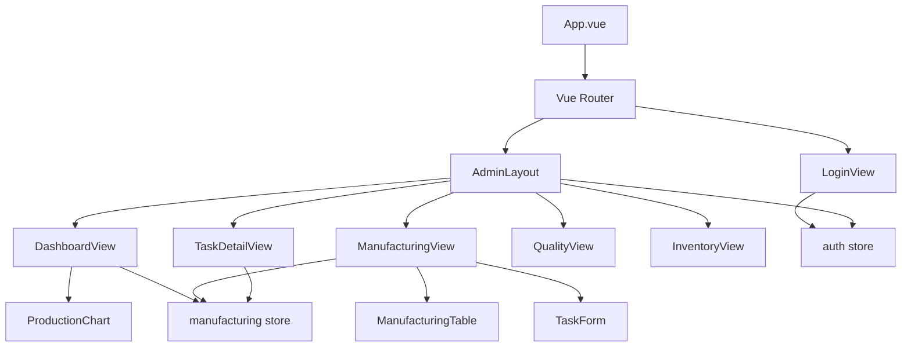
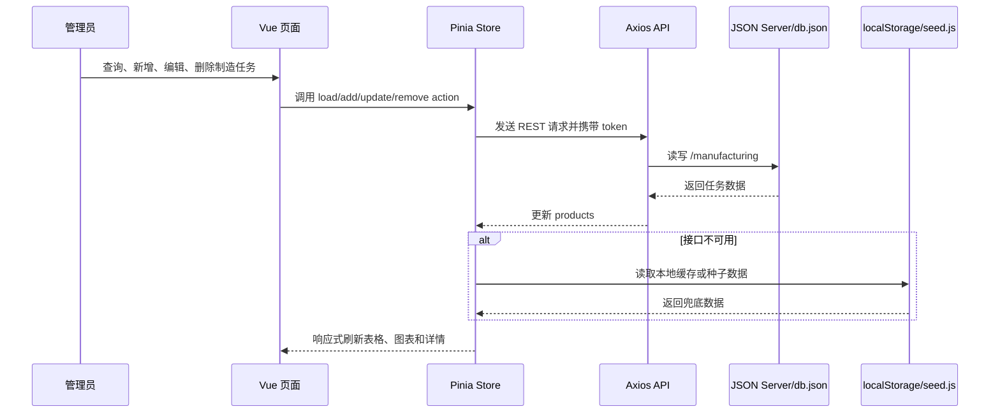

# 温州皮鞋工业制造平台项目设计文档

工业互联网应用系统前端技术期末大作业

## 目录

- 一、项目概述
- 二、需求分析与用户场景
- 三、功能范围
- 四、技术选型
- 五、系统架构与目录结构
- 六、关键实现说明
- 七、交互体验与性能优化
- 八、创新设计
- 九、测试与验收
- 十、总结与后续扩展

## 一、项目概述

本项目选取温州皮鞋制造企业作为场景，做的是一个课程级的工业互联网前端后台。页面围绕生产任务展开，把任务进度、交付日期、负责人、质量风险和库存状态放在同一个操作台里，方便课堂演示时从“工厂每天要看什么”讲起，而不是只展示几张静态页面。
选题来自课程 PPT 第 26 页之后的“温州皮鞋工业制造平台”项目实战，并按期末大作业 Word 文件中的评分点补齐功能。系统覆盖登录验证、后台布局、经营概览、制造清单、质量管理、仓储物料、动态详情页、数据可视化和导出功能。制造清单承担主要 CRUD，能演示新增、查询、修改、删除和详情下钻这一条完整路径。
项目采用 Vite 创建 Vue 3 单页应用，使用组合式 API 编写页面逻辑，通过 Vue Router 4 管理页面跳转、嵌套路由和登录守卫，通过 Pinia 管理用户状态和制造任务状态，通过 Element Plus 提供表单、表格、弹窗、分页和反馈组件，通过 Axios 连接 JSON Server 模拟的 REST API。系统同时设计了本地种子数据兜底机制，保证只运行前端时仍然可以完成课堂演示。

## 二、需求分析与用户场景

皮鞋制造企业的生产过程涉及订单确认、备料、裁断、针车、成型、质检、包装和发货等多个环节。不同环节通常由不同负责人推进，管理人员需要快速知道每个任务处于什么状态、是否存在延期风险、质量异常是否超出阈值、关键物料是否不足。若仍依赖人工汇报，信息滞后会导致排产冲突、交付风险和库存浪费。
本系统的主要用户是生产管理员。管理员登录后台后，首先进入经营概览页面，查看制造任务总数、生产中数量、延期风险数量和总体完成率。随后可以进入制造清单页面，根据产品、型号、负责人、产线和状态筛选任务，也可以新增、编辑、删除任务。对于重点任务，管理员可以进入动态详情页查看生产进度、负责人、质量不良率、库存风险和交付日期。
质量负责人关注质检批次、抽检数量、合格数量、异常说明和处理责任人。仓储人员关注关键物料的库存数量、安全库存和预警状态。本项目将质量管理和仓储物料作为扩展页面实现，既满足课程要求中的“学生发挥创意，设计其他功能”，也为后续扩展完整 CRUD 模块留下清晰边界。

## 三、功能范围

系统功能由五个主要部分组成。第一是登录验证，演示账号为 admin，密码为 123456。登录成功后，系统把 token 和用户信息保存到 localStorage，刷新页面不会丢失登录状态。未登录用户访问后台路由时，会被 router.beforeEach 守卫重定向到登录页。
第二是经营概览，展示制造任务统计卡片、生产计划和完成数量柱状图、重点交付提醒以及数据来源提示。该页面使用 onMounted 生命周期钩子加载制造数据，并使用 ECharts 完成可视化展示。若 JSON Server 未启动，页面显示黄色提示，说明当前使用 localStorage 种子数据。
第三是制造清单，这是项目的核心业务页面。页面包含筛选工具栏、状态筛选、导出按钮、新增按钮、Element Plus 表格、进度条、分页和编辑弹窗。新增和编辑共用 TaskForm 组件，表单通过 props 接收初始值，通过 emit 向父组件提交数据，体现组件化开发和组件通信。删除操作使用确认弹窗，避免误删。
第四是动态详情页。路由路径为 /app/manufacturing/:id，通过 Vue Router 动态参数匹配对应任务。详情页展示编号、产品、型号、分类、材质、进度、负责人、产线、不良率、库存风险和交付日期。这个页面满足 Word 文件要求中的动态路由匹配要求，也让制造任务具备更完整的信息查看流程。
第五是质量管理和仓储物料扩展页面。质量页面用质检批次表格展示抽检信息和异常说明；仓储页面用物料卡片展示库存、安全库存和预警状态。这两个模块当前采用静态业务数据，主要用于补齐鞋厂业务视角。后续如果继续做，可以按制造清单的模式接入 JSON Server CRUD。

## 四、技术选型

Vue 3 是项目的基础框架，适合构建响应式单页应用。项目使用 script setup 和组合式 API，使状态、计算属性、生命周期和方法可以围绕功能组织，代码比传统 Options API 更集中。经营概览、制造清单、详情页和图表组件都使用 onMounted 等生命周期钩子加载数据或初始化图表。
Vue Router 4 用于路由管理。项目配置了 /login 登录路由，以及 /app 下的后台嵌套路由，包括 dashboard、manufacturing、manufacturing/:id、quality 和 inventory。router.beforeEach 根据 meta.requiresAuth 判断是否需要登录，并在用户未登录时跳转到 /login；后台子路由通过 meta.roles 声明 admin 角色要求，守卫会校验 auth store 中的用户角色。后台页面复用 AdminLayout，因此公共侧边栏、顶部标题和内容区域只编写一次。
Pinia 用于状态管理。auth store 负责用户、token、登录和退出；manufacturing store 负责制造任务列表、加载状态、数据来源状态、统计 getter 和 CRUD actions。状态持久化使用 localStorage 直接实现，避免为了简单作业引入额外持久化插件。这样既满足“状态持久化”的评分要求，也保持依赖数量可控。
Element Plus 是第三方 UI 组件库，项目使用了 el-form、el-input、el-select、el-date-picker、el-table、el-dialog、el-pagination、el-progress、el-alert、el-tag、el-button 等组件。表单校验规则覆盖必填项、密码长度、数量范围和日期选择，错误反馈由 Element Plus 自动呈现。Axios 负责统一 HTTP 请求，并通过请求拦截器携带 token。JSON Server 提供 /manufacturing REST 接口，用于模拟真实后端。
ECharts 用于经营概览中的计划数量和完成数量可视化。它是本项目的特色功能之一，能让管理人员快速比较不同任务的产能计划和完成情况。考虑到 ECharts 体积较大，图表仅在 DashboardView 懒加载路由中使用，不放入首屏登录页，从而降低初始访问压力。

## 五、系统架构与目录结构

项目按照“页面层、状态层、请求层、数据层”组织。页面层包括 views 和 layouts，负责界面展示和用户交互；组件层包括 TaskForm、ManufacturingTable 和 ProductionChart，负责可复用表单、表格与图表；状态层 stores 负责共享业务状态、统计数据和业务操作；请求层 api 负责 Axios 实例和制造接口；数据层由 db.json 和 src/data/seed.js 组成，分别对应 JSON Server 数据和前端兜底数据。
典型数据流为：页面触发操作，调用 Pinia action；Pinia action 调用 Axios API；JSON Server 写入或返回 db.json 数据；store 更新 products；页面通过响应式数据自动刷新。若 API 不可用，store 将 usingMock 置为 true，并使用 localStorage 或种子数据继续运行。这种设计让前端边界更稳，不会因为后端模拟服务未启动而完全不可用。
核心目录如下：src/api 存放 http.js 和 manufacturing.js；src/stores 存放 auth.js 和 manufacturing.js；src/router 存放路由表和守卫；src/layouts 存放 AdminLayout.vue；src/views 存放 LoginView、DashboardView、ManufacturingView、TaskDetailView、QualityView 和 InventoryView；src/components 存放 TaskForm、ManufacturingTable 和 ProductionChart；src/style.css 存放全局视觉样式和响应式规则。

组件关系图如下，展示页面、布局、通用组件、业务组件和状态模块之间的调用关系：

数据流图如下，展示制造任务从页面交互到 Pinia、Axios、JSON Server 和本地兜底缓存的完整链路：

## 六、关键实现说明

登录实现采用最小但完整的课程方案。LoginView 使用 reactive 管理表单对象，使用 Element Plus 表单规则完成账号和密码校验。提交后调用 authStore.login，如果账号密码不匹配则抛出错误并显示 ElMessage；登录成功后写入 localStorage 并跳转到 redirect 参数或经营概览页。退出时清除 token 和用户信息，返回登录页。
路由守卫通过 meta.requiresAuth 实现登录拦截，通过 meta.roles 实现角色校验。后台父路由 /app 挂载 AdminLayout，并设置 requiresAuth；其 children 包含各业务页面，构成多级嵌套路由。每个后台子路由声明 roles: ['admin']，beforeEach 会读取 auth store 中的 role，不符合角色要求时返回经营概览页。制造详情页使用 manufacturing/:id 动态参数，用户点击表格中的“详情”按钮后进入对应任务详情。这满足 Word 评分细则中对多级路由、动态路由和 beforeEach 权限控制的要求。
制造清单的 CRUD 集中在 manufacturing store 中实现。loadProducts 尝试请求 JSON Server，如果成功则使用远程数据；如果失败则使用 localStorage 或 seedManufacturing，并设置 usingMock。addProduct、updateProduct 和 removeProduct 也遵循相同策略：优先写入 API，失败时降级为本地数据。这种设计比在每个页面分别判断接口是否可用更简单，也避免重复代码。
TaskForm 是通用业务表单组件。它通过 modelValue 接收编辑对象，使用 watch 将外部数据同步到内部 reactive form；提交时先调用 formRef.validate，验证成功后 emit submit。父组件 ManufacturingView 负责判断是新增还是编辑，并调用对应 store action。这体现了 props/$emit 的组件通信，也让表单字段、验证规则和按钮逻辑集中维护。ManufacturingTable 是通用表格组件，通过 rows 和 loading 接收数据，通过 detail、edit、remove 事件把用户操作交回父组件处理，使制造清单页面保持业务编排职责，而不是把所有表格列、按钮和事件都堆在页面里。
ProductionChart 组件在 onMounted 中初始化 ECharts，在 watch 中监听 products 变化并重新渲染，在 onUnmounted 中移除 resize 监听并销毁图表实例。这体现了组合式 API 生命周期钩子的使用，也避免图表组件卸载后残留事件监听。

## 七、交互体验与性能优化

系统在关键位置加入了加载和反馈。DashboardView 和 ManufacturingView 使用 v-loading 显示加载状态；经营概览在接口不可用时显示 el-alert；登录失败、新增成功、更新成功和删除成功均通过 ElMessage 反馈；删除前使用 ElMessageBox 二次确认。表单校验覆盖必填、长度、数值范围和正则格式校验，例如产品型号必须符合 OX-918 这类大写字母加数字的格式，负责人必须为 2-6 位中文姓名，生产线必须符合 A1智能裁断线 这类产线命名规则。
性能方面，项目使用 Vite 构建工具，页面组件采用动态 import 形成路由懒加载。后台公共布局独立于业务页面，制造详情、质量、仓储、登录和看板都按路由分块加载。Element Plus 不再使用全量 app.use(ElementPlus)，而是在 main.js 中手动注册项目实际用到的组件和 Loading 指令，App.vue 通过 ElConfigProvider 提供中文语言包。ECharts 只在经营概览页面引入，避免影响登录页和其他业务页的首屏。表格分页默认每页 5 条，筛选在前端本地完成，课程级数据量下交互响应能保持在 1 秒以内。
视觉体验方面，页面不再使用通用蓝白后台风格，而是改成更接近皮鞋制造场景的棕色皮革、暖金和深绿配色。登录页、侧边栏、顶部栏和看板卡片加入 GSAP 入场动画，动画只处理 transform 与透明度，并通过 prefers-reduced-motion 尊重系统减少动态效果设置。
性能验证方面，项目对生产构建预览地址 http://localhost:4173/login 执行 Lighthouse 13.4.0 检测。结果显示 Performance 为 0.94，First Contentful Paint 为 2.3 秒，Largest Contentful Paint 为 2.6 秒，Total Blocking Time 为 10 毫秒，Cumulative Layout Shift 为 0，满足课程评分中“首屏加载时间 < 3 秒”的高分要求。性能审查结果记录在 docs/qa/performance-audit.md，原始 Lighthouse JSON 和摘要 JSON 也保存在 docs/qa 目录。
响应式设计方面，CSS 对 980px 和 640px 两个断点做了处理。小屏下登录页和后台布局从双列变为单列，侧边菜单变为网格，工具栏变为单列，指标卡片和详情卡片自动折叠，弹窗宽度限制为视口减去边距。这样可以避免文字和按钮在移动端互相遮挡。

## 八、创新设计

第一个创新点是数据可视化看板。传统制造清单只展示表格，管理人员需要自行比较数量。本项目在经营概览中使用 ECharts 同时展示计划数量和完成数量，使生产差距一眼可见。配合统计卡片和交付提醒，页面既有总览信息，也能下钻到具体任务。
第二个创新点是前后端双运行模式。课堂演示经常出现模拟服务未启动、端口占用或网络环境不稳定的问题。本项目在 store 中加入 API 失败兜底，JSON Server 可用时使用 REST 数据并持久化到 db.json；只运行 pnpm dev 时仍然使用 localStorage 种子数据，保证系统可演示、可筛选、可新增和可编辑。页面还会明确提示当前数据来源，避免把本地数据误认为真实后端数据。
第三个创新点是制造任务导出。ManufacturingView 根据当前筛选结果生成 CSV 文件，方便生产管理员把筛选后的任务清单交给车间或会议使用。这个功能没有引入额外依赖，只使用 Blob、URL.createObjectURL 和 a 标签下载，代码短、稳定、易解释。
第四个创新点是有节制的动效。项目使用 GSAP 处理登录页、后台侧边栏和看板卡片的入场效果，但没有引入复杂滚动叙事或全屏大屏特效。这样既能让页面比默认后台更有完成度，也不会影响课程演示时的稳定性。

## 九、测试与验收

功能验收路径为：启动项目后访问登录页，使用 admin / 123456 登录；进入经营概览，检查统计卡片、柱状图和交付提醒；进入制造清单，执行关键词筛选和状态筛选；新增一条制造任务，检查表格是否更新；编辑该任务，检查进度和状态是否变化；删除任务，确认二次确认和删除反馈；点击详情按钮，确认动态路由页面显示正确任务；刷新页面，确认登录状态和本地数据仍然存在。
工程验收包括执行 pnpm build，确认生产构建成功且 dist 目录生成；执行 pnpm start，同时启动 JSON Server 和 Vite，确认接口地址 http://localhost:3001/manufacturing 返回制造任务数据；若只执行 pnpm dev，确认系统显示本地种子数据提示且核心交互仍可用。由于项目使用 Vite、Pinia、Router 和 Element Plus 的标准写法，构建通过可以证明主要模块引用、单文件组件语法和依赖解析没有错误。
评分对应关系如下：功能交互与实现由登录、看板、制造 CRUD、质量、库存、加载状态和表单校验覆盖；代码质量与工程化由 Vite 目录结构、模块化 store、api、views 和 components 覆盖；路由与状态管理由 /app 嵌套路由、manufacturing/:id 动态路由、beforeEach 守卫、Pinia store 和 localStorage 持久化覆盖；创新与深度优化由 ECharts 看板、导出功能、路由懒加载和接口兜底覆盖；项目文档由本文档、README 和源码结构说明覆盖。

## 十、总结与后续扩展

温州皮鞋工业制造平台完成了一个课程级工业互联网前端系统的主要闭环。答辩时可以按“登录进入后台 - 查看经营概览 - 管理制造任务 - 查看详情 - 展示质量和库存扩展”的顺序演示，老师能直接看到路由、状态管理、组件通信、表单校验、CRUD、图表和导出功能。
后续如果继续深化，优先做两件事：第一，把质量管理扩展为质检批次 CRUD；第二，把仓储物料扩展为入库、出库和安全库存调整。多用户权限也可以继续做，但应该和真实后端认证一起设计，而不是只在前端多写几个账号。
本项目没有引入复杂权限模型、图表大屏编辑器或真实后端数据库。原因很简单：课程重点是 Vue 3 前端技术综合应用，当前版本要保证能稳定运行、能解释清楚、能覆盖评分点。

## 架构分层表
| 层次 | 文件位置 | 职责 |
|---|---|---|
| 页面层 | layouts / views | 展示后台外壳、页面内容、用户交互和路由出口 |
| 组件层 | components | 复用制造任务表单和生产图表 |
| 状态层 | stores | 集中管理用户、制造任务、统计数据和业务 actions |
| 请求层 | api | 封装 Axios、Token 请求头和 REST 接口 |
| 数据层 | db.json / seed.js | 提供 JSON Server 数据和前端兜底数据 |

## 十一、项目演示脚本

课堂展示时可以按照“背景说明、登录演示、看板演示、制造清单演示、详情页演示、扩展页面演示、构建验证”的顺序进行。首先说明温州鞋业由传统生产方式向数字化制造转型，工厂管理者需要在统一平台中掌握任务、进度、交付、质量和库存。随后打开登录页，说明系统采用账号密码验证和 localStorage 持久化，输入 admin / 123456 后进入后台。这个环节可以指出未登录访问 /app/dashboard 会被 beforeEach 守卫拦截到 /login。

进入经营概览后，先观察四个指标卡片：制造任务、生产中、延期风险和总体完成率。再说明柱状图展示每个型号的计划数量和完成数量，管理者可以快速识别产能缺口。若演示时没有启动 JSON Server，页面会出现数据来源提示，说明系统正在使用本地种子数据；如果执行 pnpm start，则前端和 JSON Server 会同时启动，制造数据会从 db.json 提供。这一设计能证明系统考虑了课堂演示稳定性。

制造清单演示应重点展示核心 CRUD。先输入关键词筛选，例如输入“劳保”定位防滑劳保鞋；再使用状态筛选定位“延期风险”。点击新增任务，展示 Element Plus 表单校验，例如清空产品名称后保存会出现必填提示；填写完整后保存，表格立即刷新。编辑任务时修改完成数量和状态，进度条同步变化。删除任务时弹出确认框，确认后数据从列表移除。最后点击导出清单，浏览器下载 CSV 文件，说明这是面向生产会议和车间交接的轻量功能。

详情页演示可以点击制造清单中的“详情”，进入 /app/manufacturing/:id。页面会展示动态路由参数对应的任务信息，包括产品、型号、生产进度、负责人、质量不良率、库存风险和交付日期。这个页面能够向老师证明项目不仅有普通路由，还有动态路由匹配和基于参数的数据读取。质量管理和仓储物料页面用于展示业务扩展能力：质量页面体现抽检批次和异常闭环，仓储页面体现安全库存和预警状态。

## 十二、关键文件说明

src/main.js 是应用入口，负责创建 Vue 应用，注册 Pinia、Router 和 Element Plus，并挂载到 #app。这个文件体现项目全局能力的注册位置，答辩时可以用它说明 Vue 3 应用的启动流程。src/router/index.js 是路由中心，包含公开登录页、后台嵌套路由、动态任务详情和全局 beforeEach 守卫。路由 meta 中的 title 和 subtitle 被 AdminLayout 读取，用于顶部栏标题显示，避免每个页面重复写页面头部。

src/stores/auth.js 管理登录状态，包含 user、token、isAuthed、role、login 和 logout。它把 token 和用户信息写入 localStorage，从而满足状态持久化要求。src/stores/manufacturing.js 管理制造任务，包含 products、loading、usingMock、统计 getter 和 CRUD actions。这个 store 是项目业务核心，所有制造任务页面都通过它读取和修改数据，避免页面之间出现数据不一致。

src/api/http.js 封装 Axios 实例，设置 baseURL、timeout 和请求拦截器。src/api/manufacturing.js 将制造任务 REST 接口集中成 list、create、update 和 remove，页面层不直接拼接 URL。src/components/TaskForm.vue 是通用制造任务表单，通过 props 和 emit 与父组件通信；src/components/ManufacturingTable.vue 是通用制造任务表格，通过 props 接收 rows/loading，通过 emit 暴露 detail、edit、remove 三类操作；src/components/ProductionChart.vue 是图表组件，通过 onMounted 初始化 ECharts，通过 onUnmounted 清理实例和事件监听。

src/views/ManufacturingView.vue 是最能体现综合能力的页面。它同时使用 computed、reactive、ref、onMounted、Pinia、Element Plus 表格、分页、弹窗、表单组件、导出功能和路由跳转。src/views/DashboardView.vue 体现数据统计和可视化；src/views/TaskDetailView.vue 体现动态路由；src/views/LoginView.vue 体现表单校验和登录验证；QualityView 和 InventoryView 体现业务扩展。

## 十三、风险边界与改进计划

本项目当前使用 JSON Server 模拟后端，因此安全性不能等同于真实生产系统。登录账号密码只用于课程演示，token 也是前端生成的字符串，没有服务端签名和有效期校验。当前项目做了前端路由守卫和 admin 角色判断，可以满足课程里“登录验证、路由守卫、角色校验”的展示要求；但它不能替代后端权限控制。真实工业互联网系统应由后端完成用户认证、密码哈希、接口鉴权、角色授权和审计日志。

制造任务的数据模型已经覆盖课程要求，但仍然是简化版本。真实工厂会存在订单号、客户、工序、班组、设备、工时、批次、质检记录、物料批号和异常处理单等更多字段。为了保持课程项目清晰，本系统只保留任务编号、产品、型号、分类、材质、数量、完成数、产线、负责人、交付日期、状态、优先级、不良率和库存风险。后续可以逐步拆分出订单模块、工序模块、设备模块和异常模块，而不是一次性把所有复杂字段塞进制造清单。

质量管理和仓储物料页面当前主要用于展示扩展方向，并未实现完整 CRUD。这样处理是因为期末评分的核心是 Vue3 前端技术综合应用，制造清单已经承担主要 CRUD 任务；如果继续扩展，最优先的是把质检批次做成与制造任务关联的 CRUD 模块，其次是把库存安全线和物料消耗与制造任务联动。当防滑橡胶底库存低于安全库存，系统可以自动在制造任务详情中显示库存风险，并在看板中加入物料预警数量。

性能方面，ECharts 会增加 DashboardView 的 chunk 体积。项目已经通过路由懒加载把图表限制在经营概览页面，登录页和其他页面不会一开始加载图表代码。如果未来数据量扩大，可以继续做三类优化：第一，制造清单改为服务端分页和服务端筛选；第二，ECharts 按需引入柱状图、坐标系和提示框模块；第三，对质量和库存列表使用虚拟滚动或分页。当前课程数据规模较小，继续引入这些优化会增加复杂度，因此没有提前实现。

## 十四、评分点自查

功能交互与实现方面，项目覆盖登录、经营概览、制造清单、详情、质量和库存页面，核心业务流程可以从登录一路走到制造任务新增、编辑、删除、筛选、导出和详情查看。组件化方面，后台外壳、制造任务表单和生产图表被拆分为独立组件；通信方面，TaskForm 使用 props 和 emit，页面与业务状态通过 Pinia 连接。交互方面，系统包含 Loading、Skeleton、Alert、Message、Confirm、表单校验和分页。

代码质量与工程化方面，项目遵循 Vite 默认结构并按职责扩展目录。api、stores、router、layouts、views、components 和 data 分工明确，命名围绕业务含义展开。通用表单、通用表格和图表组件均从页面中拆出，便于复用和答辩展示。路由和状态管理方面，项目实现了后台父子嵌套路由、manufacturing/:id 动态路由、beforeEach 登录拦截、角色校验、auth 和 manufacturing 两个模块化 store，以及 localStorage 持久化。创新与深度优化方面，项目包含 ECharts 可视化、CSV 导出、接口失败兜底、路由懒加载和 Element Plus 手动按需注册。项目文档方面，本文覆盖需求分析、技术选型、系统架构、组件关系图、数据流图、关键实现、演示脚本、风险边界和评分点自查，能够支撑课程提交和答辩说明。
